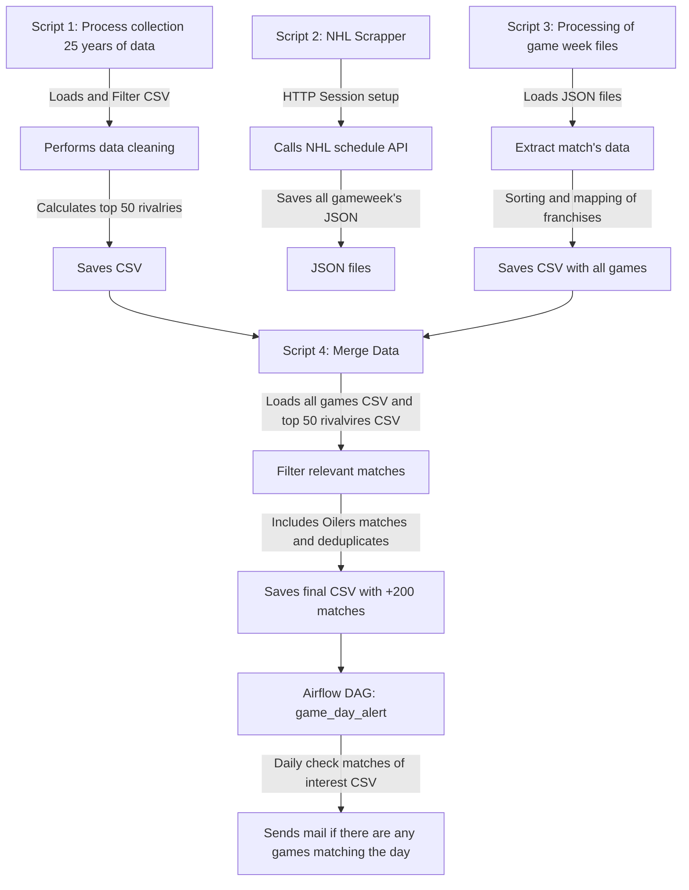
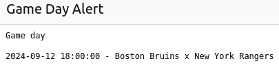

# GAME DAY RIVALRY WARNING

### SUMMARY
The objective of this project is to receive an email on the days of NHL regular-season matches that involve at least one of the top 50 rivalries of the past 25 years. Rivalries are defined based on the number of fights involving the teams, with data scraped from hockeyfights.com obtained from a separate project. The season starts in late September, and a DAG will scan the game schedule and the top 50 rivalries spreadsheet. In case of a match, an email will be sent containing details of the matches and their timings.

### WORKFLOW

#### CONTENT
| FILES                  | DESCRIPTION                                                                                             |
|------------------------|---------------------------------------------------------------------------------------------------------|
| `nhl-regular-all-fights.csv` | Contains all 25 years of fight data from hockeyfights.com                                          |
| `fight_stats.csv`           | Contains the relative frequency of the matches with fights                                          |
| `top50_fights.csv`          | Matches with the highest number of fights                                                           |
| `2024-09-21.json`           | Example response from NHL schedule API for that week's match details. The JSON directory contains all weeks until 2025-04-12 |
| `all_games.csv`             | Concatenates the schedule for the season                                                           |
| `games_of_interest.csv`     | Contains only Oilers games and the top 50 rivalries                                                |

#### MAIL TEST EXAMPLE

